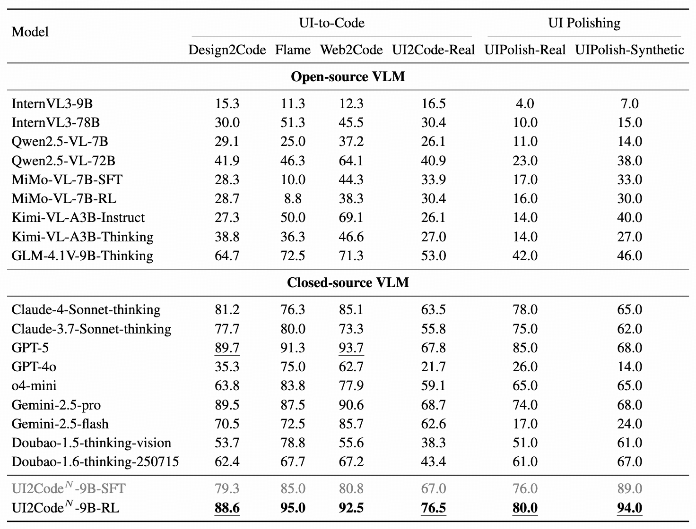
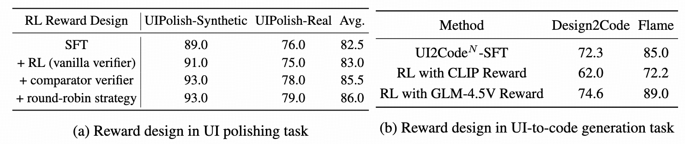

<h1>UI2Code^N: A Visual Language Model for Test-Time Scalable Interactive UI-to-Code Generation</h1>

<div align="center">
    <a href="https://huggingface.co/zai-org/UI2Code_N">🤗 Model</a> •
    <a href="https://arxiv.org/abs/***">📄 Paper</a> 
    • <a href="#demo">▶️ Demo</a>
    • <a href="https://zheny2751-dotcom.github.io/ui2code-n.github.io/">🌐 Website</a>
</div>

<br>

**UI2Code^N** is a visual language foundation model trained through staged **pretraining**, **fine-tuning**, and **reinforcement learning** to achieve foundational improvements in multimodal coding, which unifies three key capabilities: **UI-to-code generation**, **UI editing**, and **UI polishing**.
Instead of relying on single-turn paradigms that make little use of iterative visual feedback, UI2Code^N introduces an interactive UI-to-code framework that more accurately reflects real-world workflows and raises the upper bound of achievable performance.

<p align="center">
  
</p>


(**Top**) Comparison of UI-to-code generation outputs from leading models versus our model, using the same reference screenshot. Our model achieves the highest fidelity, further enhanced by our UI polishing capability. (**Bottom left**) Performance comparison on UI-to-code and UI polishing tasks. (**Bottom right**) Test-time scaling curve of our model on the UI-to-code task, enabled by our interactive UI-to-code paradigm.

## Method Overview

UI2Code^N follows an interactive UI-to-code paradigm that fundamentally departs from
prior single-turn generation approaches, redefining UI-to-code as an iterative and interactive process of **generation**, **editing**, and **polishing**.


<p align="center">
  
</p>

## Table of Contents
- [Table of Contents](#table-of-contents)
- [Demo](#demo)
- [Model](#model)
- [Quick Start](#quick-start)
  - [Setup](#setup)
  - [Rendering Config](#rendering-config)
  - [Image Rendering](#image-rendering)
- [Model Inference](#model-inference)
- [Evaluation](#evaluation)
- [Result](#result)
  - [Experimental results on UI-to-Code and UI Polishing benchmarks](#experimental-results-on-ui-to-code-and-ui-polishing-benchmarks)
  - [Reward Design](#reward-design)
- [Citation](#citation)

## Demo
We provide a ready-to-run demo script that deploys **UI2Code^N**, allowing users to experience interactive UI-to-code generation, editing, and polishing directly through a command-line or web-based interface.

After downloading the model, run the following command to launch the demo::
```bash
cd demo
bash run_demo.sh
```

This demo will:

* Load pretrained checkpoints for UI2Code^N and initialize the visual-language pipeline.
* Accept a UI screenshot and a user prompt as input.
* Generate corresponding front-end code (e.g., HTML/CSS/React) with high fidelity to the visual layout.

🎬 A short demonstration is provided below, featuring UI-to-code generation, UI editing, and UI polishing. The demo highlights how UI2Code^N enables seamless transitions between these capabilities within a unified interactive workflow.

https://github.com/user-attachments/assets/9317c567-2b25-40c0-a4f3-7c8edd7a4387

UI2Code^N achieves performance comparable to leading closed-source models such as Claude-4-Sonnet and GPT-5.

## Model
UI2Code^N is built on `GLM-4.1V-9B-Base`, which is publicly available on [Hugging Face](https://huggingface.co/zai-org/Glyph/). 
Welcome to download and use it!

## Quick Start

### Setup
First, please install the required dependencies using the following command:
```bash
apt-get install poppler-utils
pip install transformers==4.57.1 
# Optional
pip install vllm==0.10.2 sglang==0.5.2
```
Then, run the following code:

```python
from transformers import AutoProcessor, AutoModelForImageTextToText
import torch

messages = [
    {
        "role": "user",
        "content": [
            {
                "type": "image",
                "url": "https://raw.githubusercontent.com/thu-coai/Glyph/main/assets/Little_Red_Riding_Hood.png"
            },
            {
                "type": "text",
                "text": "Who pretended to be Little Red Riding Hood's grandmother"
            }
        ],
    }
]
processor = AutoProcessor.from_pretrained("zai-org/Glyph")
model = AutoModelForImageTextToText.from_pretrained(
    pretrained_model_name_or_path="zai-org/Glyph",
    torch_dtype=torch.bfloat16,
    device_map="auto",
)
inputs = processor.apply_chat_template(
    messages,
    tokenize=True,
    add_generation_prompt=True,
    return_dict=True,
    return_tensors="pt"
).to(model.device)
generated_ids = model.generate(**inputs, max_new_tokens=8192)
output_text = processor.decode(generated_ids[0][inputs["input_ids"].shape[1]:], skip_special_tokens=False)
print(output_text)
```

### Rendering Config
We provide the post-training configurations for both English and Chinese in the `config` directory, along with the corresponding fonts.

You can customize the newline behavior using the `newline-markup` option in the config file, which could affect the compression ratio:
-   Set `"newline-markup": "<font color=\"#FF0000\"> \\n </font>"` to use a special visual marker for newlines.
-   Set `"newline-markup": "<br/>"` for standard line breaks.

The compression ratio is also influenced by the DPI setting:
-   **DPI=72**: Achieving an average compression of 3-4x, which is the best trade-off between compression ratio and performance.
-   **DPI=96**: Achieving an average compression of 2-3x, which usually leads to better results than dpi 72.

A rendering example:


### Image Rendering
We provide scripts to render long text into images for your convenience.

This is a simple example of rendering a single text file (e.g., input.txt) into a sequence of images. You can adjust the rendering style by modifying `CONFIG_EN_PATH`.
```python
from test_word2png_function_fast import text_to_images

CONFIG_EN_PATH = '../config/config_en.json'
OUTPUT_DIR = './output_images'
INPUT_FILE = './input.txt'

# Read text from file
with open(INPUT_FILE, 'r', encoding='utf-8') as f:
    text = f.read()

# Convert text to images
images = text_to_images(
    text=text,
    output_dir=OUTPUT_DIR,
    config_path=CONFIG_EN_PATH,
    unique_id='test_001'
)

print(f"\nGenerated {len(images)} image(s):")
for img_path in images:
    print(f"  {img_path}")
```

**Note:** The current text rendering feature is implemented using the `reportlab` library. While the overall process is stable, there is still significant room for acceleration.

## Model Inference
After rendering the text into images, you can perform inference with the VLM.

```python
from vlm_inference import vlm_inference

response = vlm_inference(
    question="Based on the story in the figures, what is the ending of the wolf?",
    image_paths=["./output_images/Little_Red_Riding_Hood/page_001.png"]
)
print("VLM's Response:")
print(response)
```

## Evaluation

We provide evaluation scripts and test cases for both widely used benchmarks (Design2Code, Flame-React-Eva, Web2Code) and our constructed benchmarks (UI2Code-Real, UIPolish-Real, UIPolish-Synthetic). For detailed instructions on running the evaluations, please refer to the guide in [evaluation/readme.md](./evaluation/readme.md).

## Result

### Experimental results on UI-to-Code and UI Polishing benchmarks

UI2Code^N surpasses all open-source models by a large margin and even matches the performance of leading closed-source systems such as Claude-4-Sonnet-thinking and Gemini-2.5-pro

### Reward Design

UI2Code^N designs three strategies for assessing UI polishing performance: the vanilla verifier, the verifier with a comparator function, and the verifier with both a comparator function and a round-robin strategy. UI2Code^N leverages automatic similarity measures and human-aligned judgments for UI-to-code generation: VLM Score and CLIP score.


## Citation
If you find our model or code useful in your research, please cite our paper:
```
@article{ui2coden2025,
    title   = {UI2Code$^{N}$: A Visual Language Model for Test-Time Scalable Interactive UI-to-Code Generation},
    author  = {Yang, Zhen and Hong, Wenyi and Xu, Mingde and Fan, Xinyue and Wang, Weihan and Gu, Xiaotao and Tang, Jie},
    journal = {arXiv preprint arXiv:2501.XXXXX},
    year    = {2025}
}
```
